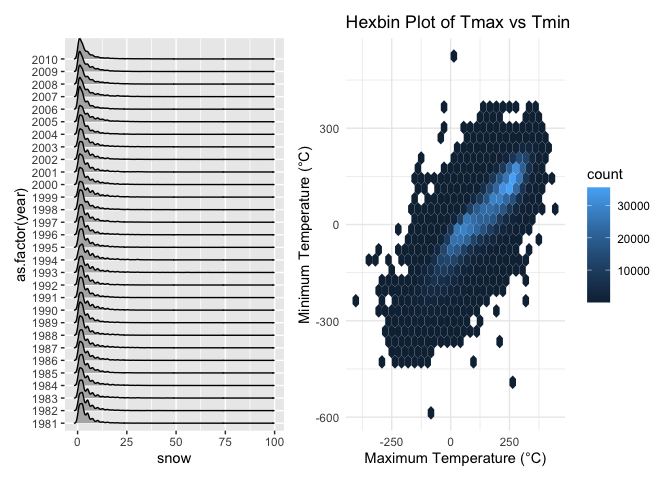
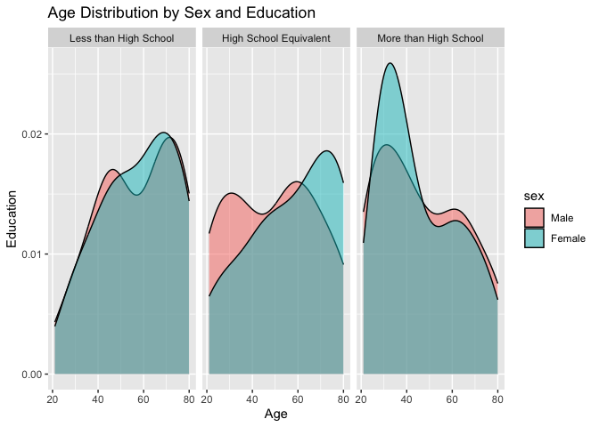

hw 3
================
cathy
2024-10-13

Load the package that needed for this hw.

    ## ── Attaching core tidyverse packages ──────────────────────── tidyverse 2.0.0 ──
    ## ✔ dplyr     1.1.4     ✔ readr     2.1.5
    ## ✔ forcats   1.0.0     ✔ stringr   1.5.1
    ## ✔ ggplot2   3.5.1     ✔ tibble    3.2.1
    ## ✔ lubridate 1.9.3     ✔ tidyr     1.3.1
    ## ✔ purrr     1.0.2     
    ## ── Conflicts ────────────────────────────────────────── tidyverse_conflicts() ──
    ## ✖ dplyr::filter() masks stats::filter()
    ## ✖ dplyr::lag()    masks stats::lag()
    ## ℹ Use the conflicted package (<http://conflicted.r-lib.org/>) to force all conflicts to become errors

## Problem 2

import and clean “nhanes_covar” data

``` r
 covar_df =  
   read_csv("data/nhanes_covar.csv", 
             na = c("NA",".",""),
             skip = 4
            ) |> 
   janitor::clean_names()
```

    ## Rows: 250 Columns: 5
    ## ── Column specification ────────────────────────────────────────────────────────
    ## Delimiter: ","
    ## dbl (5): SEQN, sex, age, BMI, education
    ## 
    ## ℹ Use `spec()` to retrieve the full column specification for this data.
    ## ℹ Specify the column types or set `show_col_types = FALSE` to quiet this message.

import and clean “nhanes_accel” data create a total activity variable
for each participant

``` r
 accel_df =  
   read_csv("data/nhanes_accel.csv", 
             na = c("NA",".","")) |> 
   janitor::clean_names() |>
   mutate(total_activity = 
            rowSums(across(starts_with("min")), na.rm = TRUE)) |> 
   relocate(total_activity)
```

    ## Rows: 250 Columns: 1441
    ## ── Column specification ────────────────────────────────────────────────────────
    ## Delimiter: ","
    ## dbl (1441): SEQN, min1, min2, min3, min4, min5, min6, min7, min8, min9, min1...
    ## 
    ## ℹ Use `spec()` to retrieve the full column specification for this data.
    ## ℹ Specify the column types or set `show_col_types = FALSE` to quiet this message.

Merge the 2 dataset into 1

``` r
 merged_df =
   covar_df|> 
   left_join(accel_df, by = "seqn") |> 
   mutate(
    sex = factor(sex, levels = c(1, 2), labels = c("Male", "Female")),
    education = factor(education, levels = c(1, 2, 3), labels = c("Less than High School", "High School Equivalent", "More than High School"))
  ) |> 
   filter(age >= 21, !is.na(sex), !is.na(bmi), !is.na(education)) |> 
   relocate(seqn, sex, age, bmi, education, total_activity)
```

Create a visualization of the age distributions for men and women in
each education category

``` r
edu_bysex_table =
  merged_df |> 
  group_by(sex, education) |> 
  summarise(count = n(), .groups = 'drop')
```

create histogram and box plot

``` r
edu_bysex_plot =
  ggplot(merged_df, aes(x = age, fill = sex)) +
  geom_histogram(position = "dodge", bins = 10) +
  facet_grid(sex ~ education) +
  labs(title = "Age Distribution by Sex and Education",
       x = "Age",
       y = "Count") +
  theme_minimal()

print(edu_bysex_plot)
```

<!-- -->

``` r
age_boxplot = ggplot(merged_df, aes(x = education, y = age, fill = sex)) +
  geom_boxplot() +
  facet_wrap(~ sex) +
  labs(title = "Age Distribution by Sex and Education",
       x = "Education",
       y = "Age") +
  theme_minimal()

print(age_boxplot)
```

<!-- -->

Comment:

Plot these total activities (y-axis) against age (x-axis) compare men to
women and have separate panels for each education level

``` r
 activity_plot =
   ggplot(merged_df, aes(x = age, y = total_activity, color = sex)) +
   geom_point(alpha = 0.5) +  
   geom_smooth(se = FALSE) + 
   facet_wrap(~ education, scales = "free_y") + 
   labs(title = "Total Daily Activity by Age, Sex, and Education Level",
        x = "Age",
        y = "Total Activity",
        color = "Sex") +
  theme_minimal() + 
  theme(legend.position = "bottom")

print(activity_plot)
```

    ## `geom_smooth()` using method = 'loess' and formula = 'y ~ x'

<!-- -->

Comment:

Make a three-panel plot that shows the 24-hour activity time courses for
each education level and use color to indicate sex

``` r
long_accel_df =
  merged_df |> 
  pivot_longer(
    cols = starts_with("min"),
    names_to = "minute",
    names_prefix = "min",
    values_to = "activity_level"
  ) |> 
  mutate(
    minute = as.numeric(sub("min", "", minute)) / 1440 * 24 
  )
```

``` r
 time_course_plot =
   ggplot(long_accel_df, aes(x = minute, y = activity_level, color = sex)) +
   geom_line(alpha = 0.3, size = 0.5) + 
   geom_smooth(se = FALSE, span = 0.2) + 
   facet_wrap(~ education, scales = "free_y") + 
   labs(
        title = "24-Hour Activity Time Course by Education Level and Sex",
        x = "Time of Day (hours)",
        y = "Activity Level",
        color = "Sex") +
   theme_minimal() +  
   theme(legend.position = "bottom", plot.title = element_text(hjust = 0.5))
```

    ## Warning: Using `size` aesthetic for lines was deprecated in ggplot2 3.4.0.
    ## ℹ Please use `linewidth` instead.
    ## This warning is displayed once every 8 hours.
    ## Call `lifecycle::last_lifecycle_warnings()` to see where this warning was
    ## generated.

``` r
print(time_course_plot)
```

    ## `geom_smooth()` using method = 'gam' and formula = 'y ~ s(x, bs = "cs")'

<!-- -->

Describe:

## Problem 3

import and clean 4 dataset combine all the 4 datasets

``` r
 jan20_df = 
   read_csv("data/citibike/Jan 2020 Citi.csv", na = c("NA",".","")) |> 
   janitor::clean_names()
```

    ## Rows: 12420 Columns: 7
    ## ── Column specification ────────────────────────────────────────────────────────
    ## Delimiter: ","
    ## chr (6): ride_id, rideable_type, weekdays, start_station_name, end_station_n...
    ## dbl (1): duration
    ## 
    ## ℹ Use `spec()` to retrieve the full column specification for this data.
    ## ℹ Specify the column types or set `show_col_types = FALSE` to quiet this message.

``` r
 jan24_df = 
   read_csv("data/citibike/Jan 2024 Citi.csv", na = c("NA",".","")) |> 
   janitor::clean_names()
```

    ## Rows: 18861 Columns: 7
    ## ── Column specification ────────────────────────────────────────────────────────
    ## Delimiter: ","
    ## chr (6): ride_id, rideable_type, weekdays, start_station_name, end_station_n...
    ## dbl (1): duration
    ## 
    ## ℹ Use `spec()` to retrieve the full column specification for this data.
    ## ℹ Specify the column types or set `show_col_types = FALSE` to quiet this message.

``` r
 july20_df = 
   read_csv("data/citibike/July 2020 Citi.csv", na = c("NA",".","")) |> 
   janitor::clean_names()
```

    ## Rows: 21048 Columns: 7
    ## ── Column specification ────────────────────────────────────────────────────────
    ## Delimiter: ","
    ## chr (6): ride_id, rideable_type, weekdays, start_station_name, end_station_n...
    ## dbl (1): duration
    ## 
    ## ℹ Use `spec()` to retrieve the full column specification for this data.
    ## ℹ Specify the column types or set `show_col_types = FALSE` to quiet this message.

``` r
 july24_df = 
   read_csv("data/citibike/July 2024 Citi.csv", na = c("NA",".","")) |> 
   janitor::clean_names()
```

    ## Rows: 47156 Columns: 7
    ## ── Column specification ────────────────────────────────────────────────────────
    ## Delimiter: ","
    ## chr (6): ride_id, rideable_type, weekdays, start_station_name, end_station_n...
    ## dbl (1): duration
    ## 
    ## ℹ Use `spec()` to retrieve the full column specification for this data.
    ## ℹ Specify the column types or set `show_col_types = FALSE` to quiet this message.

``` r
 citibike_df = 
   bind_rows(
   jan20_df |> 
     mutate(month = "January", year = 2020),
   jan24_df |>
     mutate(month = "January", year = 2024),
   july20_df |> 
     mutate(month = "July", year = 2020),
   july24_df |> 
     mutate(month = "July", year = 2024)
   )
```

Discribe:

Produce a reader-friendly table showing the total number of rides in
each combination of year and month separating casual riders and Citi
Bike members.

``` r
 ride_counts =
   citibike_df |> 
   group_by(year, month, member_casual) |> 
   summarise(total_rides = n()) |> 
   pivot_wider(names_from = member_casual, values_from = total_rides) |>
   kable()
```

    ## `summarise()` has grouped output by 'year', 'month'. You can override using the
    ## `.groups` argument.

``` r
print(ride_counts)
```

    ## 
    ## 
    ## | year|month   | casual| member|
    ## |----:|:-------|------:|------:|
    ## | 2020|January |    984|  11436|
    ## | 2020|July    |   5637|  15411|
    ## | 2024|January |   2108|  16753|
    ## | 2024|July    |  10894|  36262|

Comment: from the result, we know that all of the member riders have a
higher frequency than the casual riders. The number of total rides for
members is increasing from 2020 Jan to 2024 July. For casual riders, the
total rides in 2020 kept increasing, but in 2024 Jan decreased then in
2024 July increased again.

Make a table showing the 5 most popular starting stations for July 2024;
include the number of rides originating from these stations.

``` r
 top_stations_july24 =
   july24_df |> 
   group_by(start_station_name) |> 
   summarise(total_rides = n(), .groups = "drop") |> 
   arrange(desc(total_rides)) |> 
   slice_head(n = 5) |> 
   kable()

 print(top_stations_july24)
```

    ## 
    ## 
    ## |start_station_name       | total_rides|
    ## |:------------------------|-----------:|
    ## |Pier 61 at Chelsea Piers |         163|
    ## |University Pl & E 14 St  |         155|
    ## |W 21 St & 6 Ave          |         152|
    ## |West St & Chambers St    |         150|
    ## |W 31 St & 7 Ave          |         146|

Make a plot to investigate the effects of day of the week, month, and
year on median ride duration.

``` r
 median_duration_df =
   citibike_df |> 
   mutate(weekdays = factor(weekdays, levels = c("Monday", "Tuesday", "Wednesday", "Thursday", "Friday", "Saturday", "Sunday"))) |>
   group_by(year, month, weekdays) |>
   summarize(median_duration = median(duration), .groups = "drop")
  
 duration_plot =
   median_duration_df |> 
   ggplot(aes(x = weekdays, y = median_duration, group = month, color = month)) +
   geom_line() + 
   facet_grid(. ~ year) + 
   labs(
     title = "Median Ride Duration by Day of the Week, Month, and Year",
     x = "Day of the Week",
     y = "Median Duration (in minutes)") +
   theme_minimal() +
   theme(axis.text.x = element_text(angle = 45), 
         legend.position = "bottom") 

 duration_plot
```

<!-- -->

Comment: Compare to weekday, the median ride duration is longer on
weekends in 2020. For each year, July has the longer the median ride
duration than January. In 2024, the median ride duration on Sunday has a
drop compare to Saturday. 2024 has a shorter median ride duration than
2020 in both January and July.

For data in 2024, make a figure that shows the impact of month,
membership status, and bike type on the distribution of ride duration

``` r
 citibike24_df = 
   citibike_df|> 
   filter(year == 2024)

 citibike24_df |> 
   ggplot(aes(x = duration, fill = rideable_type)) +
   geom_density(alpha = 0.5) +
   facet_grid(month ~ member_casual) +
   labs(x = "Ride Duration (minutes)", y = "Density") +
   theme_minimal()
```

<!-- -->

Make another density plot to focus more closely on the relevant parts of
the data

``` r
 citibike24_df |> 
  ggplot(aes(x = duration, fill = rideable_type)) +
  geom_density(alpha = 0.5, trim = TRUE) + 
  facet_grid(month ~ member_casual) + 
  labs(
    x = "Ride Duration (minutes)", 
    y = "Density", 
    title = "Distribution of Ride Duration by Bike Type, Membership, and Month") +
  theme_minimal() +
  scale_x_continuous(limits = c(0, 100)) 
```

    ## Warning: Removed 198 rows containing non-finite outside the scale range
    ## (`stat_density()`).

<!-- -->

Comment: Both class and electric bikes show a peak that usually in ride
duration within 30 minutes. This means that most rides, regardless of
bike type or user membership, are relatively short. Electric bikes tend
to have a slightly longer ride duration compared to classic bike.
Members tend to use classic bikes more consistently, with their
distribution being sharper and more centered around shorter durations.
